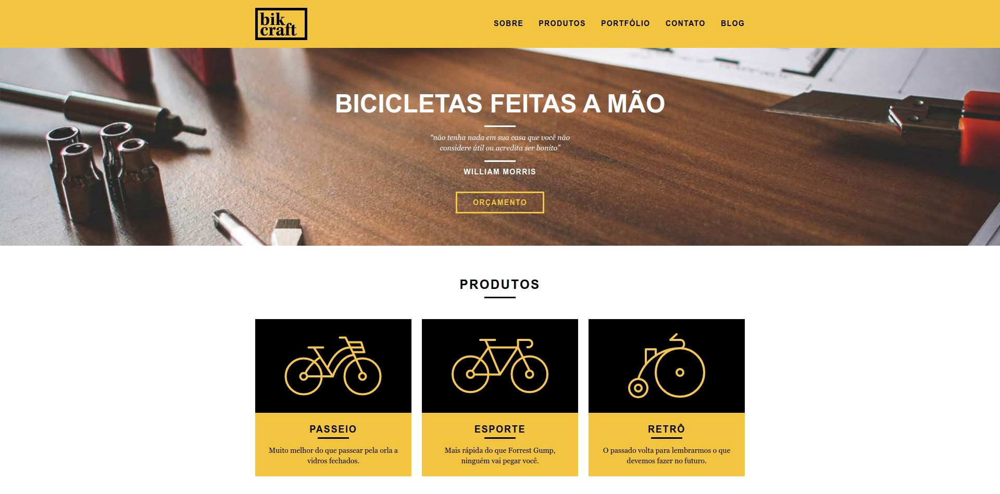

<h1 align="center">
  
</h1>

<h3 align="center">
  Curso realizado na origamid - Edu Souza o/
</h3>

<blockquote align="center">“O tempo é o melhor autor; sempre encontra um final perfeito.”</blockquote>

<h4 align="center">
  Repositório - Web Design Completo
</h4>

 

  &nbsp;
  &nbsp;
  

  <a href="#rocket-Sobre-o-curso">Sobre o curso</a>&nbsp; &nbsp; |&nbsp; &nbsp; 
  <a href="#postbox-Tecnologias">Tecnologias</a>&nbsp; &nbsp; |&nbsp; &nbsp; 
  <a href="#postbox-Entrega">Entrega</a>&nbsp; &nbsp; |&nbsp; &nbsp; 
  <a href="#unlock-Licença">Licença</a>

## :rocket: Sobre o curso

#### Web Design Completo

Este curso é para quem deseja entrar ou já está no mercado de criação de websites. Se você é um iniciante terá a oportunidade de aprender do zero e para os que já trabalham com web design/front end é uma boa oportunidade para se atualizar/aprender uma abordagem diferente.

Eu foco na teoria + prática, assim você aprende os fundamentos por trás de cada decisão de design ou código. E após isso você implementa em um projeto real. Você já sai do curso com um primeiro site profissional construído.

#### Screenshots:

   &nbsp; &nbsp; 
  

## 🚀 Tecnologias

Esse projeto foi desenvolvido com as seguintes tecnologias:

- <a href="https://developer.mozilla.org/pt-BR/docs/Web/HTML">HTML</a>
- [CSS](https://developer.mozilla.org/pt-BR/docs/Web/CSS)
- [Javascript](https://developer.mozilla.org/pt-BR/docs/Web/JavaScript)

## :postbox: Entrega

#### Concluido :clipboard:

Acesse o deploy do projeto [aqui](https://edusouza-programmer.github.io/web_design_completo-origamid/).

# 
## :unlock: Licença

Este projeto está licenciado sob a Licença MIT - consulte [LICENSE](https://opensource.org/licenses/MIT) para maiores detalhes.
